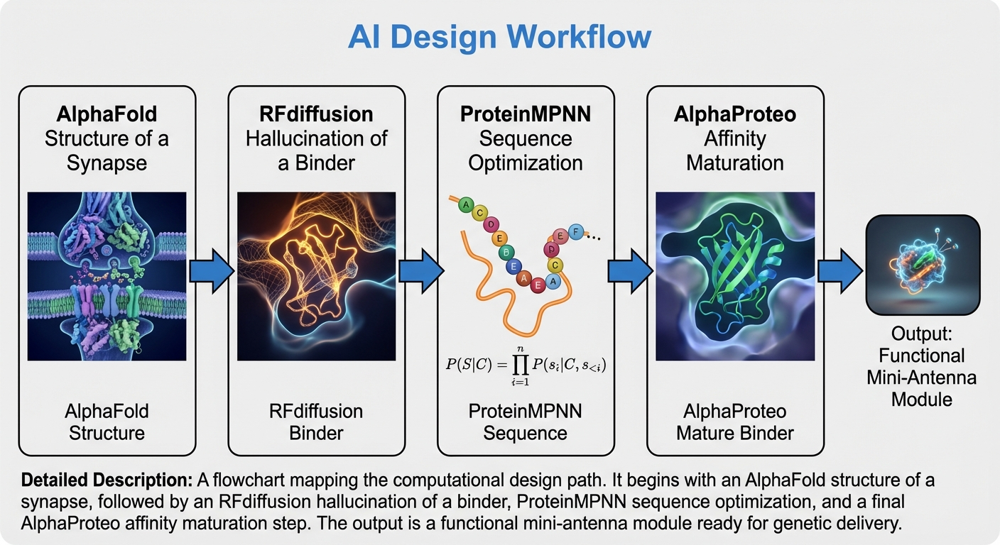

## Abstract

Implantable neural interfaces face chronic limits arising from mechanical mismatch, foreign-body response, and progressive degradation at the electrode–tissue interface, which together erode signal fidelity and long-term stability [1–4]. This paper proposes a *framework* for biologically integrated, genetically encodable “mini-antenna” modules that (i) sense molecular context (e.g., neurotransmitter state) using engineered protein binders and switches, (ii) actuate neural activity using ultrasound-responsive mediators, and (iii) report cellular state using genetically encoded acoustic contrast mechanisms. We formalize a logic-gated control concept in which biochemical inputs gate ultrasound responsiveness (e.g., AND/OR/XOR-like behavior), enabling cell-type and context-dependent neuromodulation [5–9]. We also summarize the physical trade-space among energy modalities for deep-brain access and highlight focused ultrasound as a practical compromise between penetration and focality under established safety and dosimetry constraints [10–12]. The result is a research roadmap—not a demonstrated clinical system—for building and validating modular, protein-based interfaces that couple molecular specificity to non-invasive energy delivery and readout.

---

## 1. Bio-mechanical limits of traditional implanted interfaces

Chronic neural implants often trigger tissue responses (microglial activation, astrocytic encapsulation, BBB disruption, and gliosis) that can increase access impedance and degrade recording/stimulation performance over time [1–4]. For stimulation electrodes, a common phenomenological description uses a Randles-type circuit with a constant phase element (CPE) capturing dispersive interfacial behavior:

$$
Z(\omega)=R_s+\left(\frac{1}{\frac{1}{R_{ct}}+Q(j\omega)^{\alpha}}\right)
\tag{1}
$$

where $R_s$ is solution/tissue resistance, $R_{ct}$ is charge-transfer resistance, $Q$ and $\alpha \in(0,1]$ parameterize the CPE, and $j=\sqrt{-1}$ [3,4]. Changes in encapsulation and interface chemistry can shift $(Q,\alpha)$ and effective impedance spectra, impacting both stimulation efficiency and recording SNR [1–4]. These limitations motivate complementary paradigms in which key sensing/actuation functions are performed by *biological* components—engineered proteins and genetically targeted expression—rather than rigid inorganic interfaces.

---

## 2. Substrate optimization: engineered proteins vs. synthetic alternatives

A “mini-antenna” substrate should support (i) genetic encodability and targeting, (ii) modularity for composable sensing/logic/actuation, (iii) biocompatibility and turnover, and (iv) measurable transduction (optical/acoustic/electrochemical).

### 2.1 Synthetic chemicals and voltage-sensitive dyes

Small-molecule voltage indicators can achieve fast temporal responses, but typically lack genetic cell-type specificity and may pose toxicity or nonspecific binding risks depending on chemistry and delivery [13,14]. Rather than asserting a universal closed-form fluorescence relation, a safer generic statement is that fluorescence or spectral shift is driven by an electrochromic (Stark) response to local field ($E$):

$$
\Delta \nu \propto -\Delta\mu\cdot E - \frac{1}{2}\Delta\alpha E^2
\tag{2}
$$

where $\Delta\mu$ is the change in dipole moment and $\Delta\alpha$ is the change in polarizability between electronic states; practical $\Delta F/F$ depends on dye photophysics and detection bandpass [13,14].

### 2.2 DNA / nucleic-acid logic circuits

DNA strand-displacement enables predictable circuit design and high logical complexity in vitro. Reaction rates can be approximated by Arrhenius/Eyring-type behavior:

$$
k_{\mathrm{obs}} \approx k_0 e^{-\Delta G^{\ddagger}/RT}
\tag{3}
$$

but deployment in mammalian CNS environments faces challenges from nuclease degradation, delivery constraints, and difficulty coupling nucleic-acid circuits to mechanical energy modalities [15,16].

### 2.3 Engineered proteins and de novo switches

Engineered proteins are uniquely suited for genetic targeting and modular integration. De novo switch architectures such as LOCKR/Co-LOCKR and related designed protein logic systems demonstrate AND/OR/NOT-like behaviors via conformational gating and component colocalization [5–7]. A generic two-state switch description is:

$$
K_{\mathrm{open}}=\frac{[S_{\mathrm{open}}]}{[S_{\mathrm{closed}}]}=e^{-\Delta G_{\mathrm{open}}/RT}
\tag{4}
$$

where $\Delta G_{\mathrm{open}}$ can be modulated by ligand binding, peptide “keys,” or engineered interactions [5–7]. These constructs provide an existence proof for protein-level Boolean logic and motivate repurposing similar switch motifs to gate *ultrasound responsiveness*.

---

## 3. Comparative substrate summary (Table 1)

**Table 1. Comparison of candidate molecular substrates.**

| Substrate | Logic | Precision | Readout | CNS Compat. |
| :--- | :---: | :---: | :---: | :--- |
| **Eng. proteins** | **High** | **High** (genetic) | Optical/Acoustic | **High** (biodegradable) |
| Synthetic dyes | Mod. | Low-Mod. | Optical | Variable (toxicity risk) |
| DNA circuits | V. High | Mod.-High | FRET | Moderate (nuclease sensitivity) |
| Nanoparticles | Low-Mod. | Low-Mod. | Elec./Opt. | Variable (clearance burden) |

---

## 4. Energy modality for deep-brain interaction: the acoustic trade-space

Non-invasive neuromodulation and readout require an energy modality that can (i) penetrate skull and tissue, (ii) be spatially addressable, and (iii) operate within safe exposure regimes.

Optical methods offer high spatial precision but are fundamentally limited by scattering and absorption in tissue. A commonly used effective attenuation form is:

$$
I(z)=I_0 e^{-\mu_{\mathrm{eff}} z},
\qquad
\mu_{\mathrm{eff}}=\sqrt{3\mu_a(\mu_a+\mu_s')}
\tag{5}
$$

where $\mu_a$ is absorption and $\mu_s'$ is reduced scattering [17]. By contrast, ultrasound can reach deep targets with millimeter-scale focal volumes (subject to skull aberration, frequency, aperture, and focusing method) and has an extensive safety/dosimetry literature in both imaging and neuromodulation contexts [10–12]. A simple amplitude attenuation model is:

$$
P(z)=P_0 e^{-\alpha(f) z}
\tag{6}
$$

where $\alpha(f)$ depends on frequency and medium [10–12].

**Table 2. Energy modality comparison matrix.**

| Modality | Penetration | Resolution | Deep Addressing | Interface |
| :--- | :---: | :---: | :---: | :--- |
| **Optical** | 0.5–2 mm | 1–10 $\mu$m | Superficial | File/Window |
| **Ultrasound** | **10–100 mm** | **1–3 mm** | **Excellent** | **Non-invasive** |
| **Electrode** | High | Single cell | Excellent | Invasive |
| **fMRI / PET** | Whole brain | 2–5 mm | Excellent | Non-invasive |

*Note: Focused ultrasound offers a "Goldilocks zone" for non-invasive deep access.*

**Scope note:** ultrasound is not “supreme” in an absolute sense; rather, it is a strong candidate when deep access and focality must be balanced without implants, while accepting constraints from skull propagation, heating, cavitation risk, and subject-specific beamforming requirements [10–12].

---

## 5. Sonogenetic actuation with biochemical logic gating

### 5.1 Ultrasound-responsive mediators

Sonogenetics uses genetically encoded mediators that render targeted cells more responsive to ultrasound stimulation [8–12]. Mechanosensitive ion channels (e.g., bacterial MscL variants) and engineered systems based on prestin have been used to confer ultrasound responsiveness in cellular and animal models [8,9,18]. For example, engineered prestin variants with substitutions observed in echolocating species have been reported to enable ultrasound-evoked calcium responses and in vivo neural stimulation [18]. MscL-based approaches have demonstrated ultrasound-evoked responses when expressed in specific neural targets, supporting feasibility from ex vivo to in vivo settings [8,9].

### 5.2 Logic-gated architecture (concept)

We define a *logic-gated mini-antenna* as a modular construct where a biochemical input controls whether an ultrasound stimulus produces a functional output (ion influx, neurotransmitter release modulation, transcriptional switch, etc.). A minimal AND-gate concept can be formalized as:

* **Input A:** biochemical ligand (e.g., neurotransmitter (NT)) binding to a designed sensor/switch.
* **Input B:** ultrasound stimulus producing a mechanical/biophysical driver ($G(P_{US})$).
* **Output:** probability of actuation (e.g., channel opening) given both inputs.

One phenomenological form is:

$$
P_{\mathrm{act}}([NT],P_{US}) = \underbrace{\frac{[NT]^n}{K_d^n+[NT]^n}}_{\text{biochemical gating}} \cdot \underbrace{G(P_{US})}_{\text{ultrasound driver}}
\tag{7}
$$

where $n$ is a Hill-like cooperativity parameter and $K_d$ is the effective dissociation constant of the sensing module. $G(\cdot)$ is not assumed linear; it is an empirical function shaped by mediator type, ultrasound waveform, and local boundary conditions [10–12].

**Important limitation:** current sonogenetic mechanisms remain an active research area; reported effects can depend on ultrasound parameters, expression levels, mechanotransduction context, and potential confounders (e.g., endogenous mechanosensitivity, heating, cavitation microenvironments) [10–12]. Any “logic” behavior should be treated as an engineering target requiring stringent controls, not a guaranteed property.

---

## 6. Acoustic reporter genes and “backscatter-like” readout

Genetically encoded acoustic reporter genes (ARGs) enable ultrasound imaging of gene expression or cellular populations by producing gas vesicles (GVs), air-filled protein nanostructures that scatter sound and can generate nonlinear contrast signatures [19–22]. Mammalian acoustic reporter gene systems have demonstrated ultrasound imaging of expression in mammalian cells, and subsequent work has improved contrast and enabled new forms of multiplexing and signal unmixing [20–23].

In the Rayleigh scattering regime ($ka\ll1$), an order-of-magnitude cross-section scaling can be written as:

$$
\sigma \propto k^4 a^6 |\Delta \chi|^2
\tag{8}
$$

where $k$ is wavenumber, $a$ is effective scatterer size, and $\Delta\chi$ represents an effective contrast term capturing compressibility/density differences and geometry (model-dependent) [19–22]. Recent high-throughput screening and directed evolution approaches have reported multi-fold improvements in nonlinear acoustic signal for ARG clusters at physiological temperature [21].

---

## 7. AI-assisted design pipeline for mini-antenna modules

A plausible computational workflow for constructing mini-antenna components is:

1. **Target structural modeling:** Predict receptor/ligand complexes and binding pockets using modern structure prediction (e.g., AlphaFold 3 for biomolecular interactions) [24].
2. **Generative backbone design:** Use diffusion-based protein generative models (e.g., RFdiffusion) to propose candidate scaffolds or binders conditioned on geometric constraints [25].
3. **Sequence optimization:** Use sequence design models (e.g., ProteinMPNN) to produce sequences compatible with the designed backbone and desired fold [26].
4. **Affinity maturation / binder generation:** Apply binder-design methods such as AlphaProteo or related pipelines, followed by experimental screening, to achieve functional binding and stability in relevant expression contexts [27].

This pipeline must be closed with wet-lab validation: expression, localization, functional assays, off-target profiling, immunogenicity screening, and in vivo pharmacology/toxicology.

---

## 8. Roadmap and experimental milestones (research plan)

A realistic translation path should be framed as staged scientific milestones rather than a fixed “15-year clinical plan”:

* **Milestone A (in vitro):** demonstrate biochemical gating of ultrasound responsiveness in cultured neurons with appropriate controls (no-mediator, no-ultrasound, sham ultrasound, thermal controls) [10–12].
* **Milestone B (small animal):** demonstrate cell-type-specific modulation with behavioral and electrophysiological readouts; quantify exposure margins and safety endpoints [10–12].
* **Milestone C (readout integration):** co-express ARGs or compatible acoustic reporters with actuation modules; establish sensitivity limits and multiplexing feasibility [19–23].
* **Milestone D (scaling constraints):** address skull aberration/beamforming, delivery constraints (e.g., AAV tropism, dosing, and potential need for invasive delivery), durability, and immunogenicity [10–12].

---

## 9. Safety, ethics, and definitional clarity

* **“Non-invasive” caveat:** while ultrasound delivery can be non-invasive, genetic delivery of proteins (viral vectors, nanoparticles, or other methods) may be minimally invasive (e.g., injection) or have systemic risks. Claims of fully non-invasive systems should explicitly separate *energy delivery* from *biological payload delivery*.
* **Exposure constraints:** ultrasound neuromodulation requires strict control of waveform, intensity, duty cycle, thermal rise, and cavitation risk, with skull-aware modeling and monitoring where possible [10–12].
* **Dual-use and consent:** genetic neuromodulation and remote stimulation raise substantial ethical issues (consent, misuse, privacy, autonomy). Any clinical translation would require robust governance, transparency, and post-market surveillance.

---

## References

[1] Salatino JW, Ludwig KA, Kozai TDY, Purcell EK. *Glial responses to implanted electrodes in the brain.* Nat Biomed Eng. 2017. doi:10.1038/s41551-017-0154-1.

[2] Campbell A, Wu C. *Chronically implanted intracranial electrodes: tissue response and electrical changes over time.* Micromachines. 2018;9(9):430. doi:10.3390/mi9090430.

[3] Keogh C, et al. *Optimizing the neuron–electrode interface for chronic recording and stimulation.* Neurosurg Focus. 2020;49(1):E7. doi:10.3171/2020.4.FOCUS20203.

[4] Evers JE, et al. *Stimulation-induced changes at the electrode–tissue interface and implications for DBS.* (Modeling + chronic interface characterization). 2022. PMID:35728575.

[5] Langan RA, et al. *De novo design of bioactive protein switches (LOCKR).* Nature. 2019. (LOCKR concept; conformational gating).

[6] Chen Z, et al. *De novo design of protein logic gates.* Science. 2020;368:78–84. doi:10.1126/science.aay2790.

[7] Lajoie MJ, et al. *Designed protein logic to target cells with precise combinations of surface antigens (Co-LOCKR).* Science. 2020. doi:10.1126/science.aba6527.

[8] Liu T, et al. *Sonogenetics: recent advances and future directions.* Brain Stimulation. 2022.

[9] Qiu Z, et al. *Targeted neurostimulation in mouse brains with non-invasive ultrasound via mechanosensitive channels (MscL-based).* Cell Reports. 2020.

[10] Naor O, et al. *The biophysical mechanisms of ultrasound neuromodulation.* Nat Rev Neurosci. 2016. doi:10.1038/nrn.2016.40.

[11] Tang J, et al. *Recent advancement of sonogenetics.* 2023. PMCID: PMC11214298.

[12] Hahmann J, et al. *Sonogenetics for monitoring and modulating biomolecular processes (review).* Angew Chem Int Ed. 2024.

[13] Knöpfel T, et al. *Genetically encoded fluorescent voltage indicators: principles and applications (review).* (Representative GEVI reviews).

[14] Abdelfattah AS, et al. *Voltage imaging: advances and constraints (review).* (Representative voltage imaging reviews).

[15] Seelig G, et al. *DNA strand displacement circuits and kinetics (foundational work).* (Representative strand displacement references).

[16] Reviews on nucleic-acid computation in biological environments (limitations, degradation, delivery).

[17] Jacques SL. *Optical properties of biological tissues: a review.* Phys Med Biol. 2013. doi:10.1088/0031-9155/58/11/R37.

[18] Huang Y-S, et al. *Sonogenetic modulation using an engineered auditory-sensing protein (prestin).* Nano Lett. 2020;20(2):1089–1100. doi:10.1021/acs.nanolett.9b04373.

[19] Bourdeau RW, et al. *Acoustic reporter genes for noninvasive imaging of microbes in mammalian hosts.* Nature. 2018. (ARG foundations).

[20] Farhadi A, et al. *Ultrasound imaging of gene expression in mammalian cells.* Science. 2019. doi:10.1126/science.aax4804.

[21] Hurt RC, et al. *Directed evolution of acoustic reporter genes using high-throughput acoustic screening.* ACS Synth Biol. 2024;13(7):2215–2226. doi:10.1021/acssynbio.4c00283.

[22] Hurt RC, et al. *Genomically mined acoustic reporter genes for real-time in vivo monitoring.* Nat Biotechnol. 2023. doi:10.1038/s41587-022-01581-y.

[23] Nyström NN, et al. *Multiplexed ultrasound imaging of gene expression.* Nat Methods. 2025. doi:10.1038/s41592-025-02825-w.

[24] Abramson J, et al. *Accurate structure prediction of biomolecular interactions with AlphaFold 3.* Nature. 2024. doi:10.1038/s41586-024-07487-w.

[25] Watson JL, et al. *De novo design of protein structure and function with RFdiffusion.* Nature. 2023;620:1089–1100. doi:10.1038/s41586-023-06415-8.

[26] Dauparas J, et al. *Robust deep learning–based protein sequence design using ProteinMPNN.* Science. 2022. doi:10.1126/science.add2187.

[27] Zambaldi V, et al. *De novo design of high-affinity protein binders with AlphaProteo.* arXiv:2409.08022 (2024).
